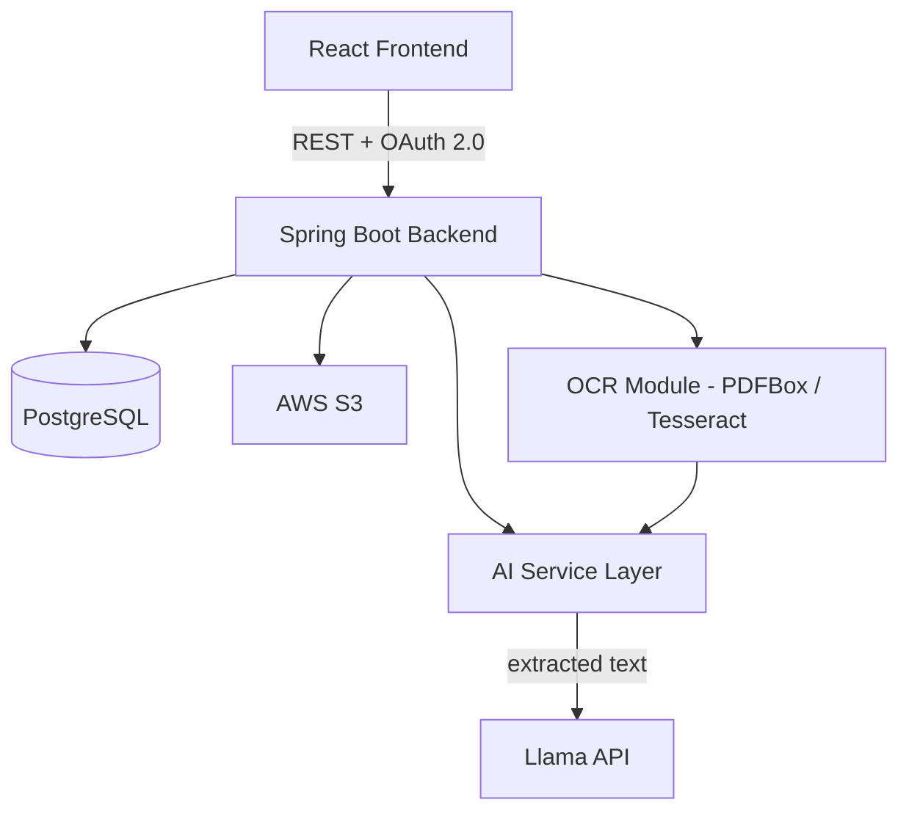

# AarogyaKul — Product Requirements Document

### Product Requirements Document

**Team:** FutureStack (Akshat Barve — Backend & Cloud, Soumya Barve — Frontend & Product)
**Document version:** 2.0
**Audience:** Coding agents (Claude Code or similar) and human contributors building the prototype. This document is written to be directly actionable — every section that defines a contract (schema, API, prompt) is meant to be implemented as written, not re-interpreted.

---

## 0. How To Use This Document

This PRD is scoped specifically to **MVP**: the 48-hour prototype build. It assumes the idea has already been pitched and judged in Round 1. Everything in Section 3 ("MVP Scope") is what gets built now. Section 13 ("Out of Scope") lists features that exist in the product vision but are explicitly deferred to the future phase — do not build them now even if they seem easy to bolt on.

If you are a coding agent picking this up cold, read sections in this order:

1. Section 3 (Scope) — know the boundary before writing code.
2. Section 6 (Data Model) — the schema is the backbone; get this right first.
3. Section 7 (API Specification) — implement against these contracts exactly.
4. Section 8 (Feature Specs) — especially 8.4 (AI Report Reader), which has the most implementation risk.
5. Section 11 (Build Sequence) — a suggested order of operations across the 48 hours.

Where this document makes an assumption instead of asking a question, that assumption is logged in Section 14. If you hit a decision point not covered here, make the most reasonable choice, implement it, and add a one-line note to a `DECISIONS.md` file in the repo root rather than blocking progress.

---

## 1. Product Summary

**AarogyaKul** is a centralized family health management platform. It replaces the current reality — medical records scattered across hospital portals, WhatsApp threads, email attachments, and physical folders — with a single dashboard per family, where each member has a structured medical profile, a document vault, and an AI layer that reads uploaded blood reports and explains what changed in plain language.

**One-line pitch:** _Upload a blood report → get plain-English changes explained in seconds._

The flagship differentiator is the **AI Report Reader**: most competing apps store documents; AarogyaKul extracts structured values from them, compares against the member's own history, and generates a human-readable summary (e.g., _"HbA1c increased from 6.2% to 7.1% over 8 months — your blood sugar control has worsened"_).

---

## 2. Goals for MVP

By the end of this 48-hour round, the team needs a **working, demoable prototype** — not a polished product — that proves the core loop:

1. A user can register, log in, and create a family with multiple members.
2. A user can upload a blood report PDF for a specific family member.
3. The system extracts medical parameter values from that PDF automatically.
4. If a previous report exists for the same member, the system compares values and generates a plain-language summary of what changed.
5. The user can see a timeline of events (uploads, diagnoses) per family member.

The demo's emotional high point is uploading a second blood report for a member who already has one on file, and watching the system say something like _"Your HbA1c has gone up 14% since your last test"_ without the user doing anything except clicking upload.

**Success criteria for MVP:** the five flows above work end-to-end, live, without the presenter needing to fake data or narrate around a broken step.

---

## 3. MVP Scope (In / Out)

### In scope — build this now

| Feature                                                | Why it's in this round                                           |
| ------------------------------------------------------ | ---------------------------------------------------------------- |
| Authentication (register, login, OAuth 2.0)            | Everything else needs a logged-in user.                          |
| Family creation & family member CRUD                   | Core data model that every other feature hangs off.              |
| Document upload to S3 (PDF only)                       | Required input for the AI Report Reader.                         |
| AI Report Reader (OCR → extract → compare → summarize) | The flagship feature — this is what gets remembered.             |
| Health Timeline (read-only event feed per member)      | Cheap to build once documents/parameters exist; high demo value. |
| Minimal frontend for all of the above                  | Without a UI, there's no demo.                                   |

### Explicitly out of scope for MVP

Medication tracking, prescription scanning, refill reminders, insurance document vault and AI policy summaries, wearable integrations, disease risk prediction, and the emergency QR health card are all **Finale-round or future roadmap** features. See Section 13 for the full list and rationale. Do not implement these now — time spent here is time not spent hardening the AI Report Reader, which is the feature judges will actually probe.

---

## 4. Tech Stack (Pinned)

Use these exact choices. Do not substitute frameworks mid-build — consistency matters more than optimality for a 48-hour sprint.

### Backend

- **Language/Runtime:** Java (latest stable version compatible with the selected Spring Boot release)
- **Framework:** Spring Boot (latest stable version compatible with all project dependencies) (Spring Web, Spring Data JPA, Spring Security)
- **Build tool:** Maven
- **Auth:** OAuth 2.0 via `io.jsonwebtoken:jjwt` (or Spring Security's built-in OAuth2 resource server if preferred — pick one and stay consistent), BCrypt for password hashing
- **Database:** PostgreSQL (latest stable version)
- **File storage:** AWS S3 (via AWS SDK for Java v2)
- **OCR:** Apache PDFBox (for text-based PDFs) with Tesseract OCR (via `tess4j`) as a fallback for scanned/image-based PDFs
- **AI layer:** Llama model served through the Hugging Face Inference API. The implementation should keep the model name configurable so newer Llama releases can be adopted without code changes.

### Frontend

- **Framework:** React + TypeScript (latest stable compatible versions)
- **Build tool:** Vite
- **Styling:** Tailwind CSS (latest stable version)
- **Charts:** Recharts (for any trend visualization on the timeline)
- **HTTP client:** Axios
- **Routing:** React Router (latest stable version)
- **State:** React Context for auth state; local component state elsewhere. Do not introduce Redux for a 48-hour build.

### Local Development

- Use `docker-compose` to run PostgreSQL locally so both team members have an identical DB without manual installs. A starter file is in Section 10.

---

## 5. System Architecture



Request flow for the core AI loop:

1. Frontend uploads a PDF via multipart form to the backend.
2. Backend streams the file to S3, creates a `MedicalDocument` row with status `PENDING`, and returns the document ID immediately (don't block the HTTP response on AI processing — see Section 8.3 for the async pattern).
3. Backend kicks off the extraction pipeline: OCR/text-extraction → Llama API call for structured parameter extraction → persist `MedicalParameter` rows → query prior parameters for the same member → Llama API call for comparison summary → persist `AIInsight` → update document status to `COMPLETED`.
4. Frontend polls (or the user simply refreshes/navigates back) to fetch the result once processing finishes.

### Backend package structure

```
com.aarogyakul
├── config/          # SecurityConfig, CorsConfig, S3Config, LlamaClientConfig
├── controller/       # REST controllers, one per resource
├── service/          # Business logic
│   └── ai/           # OcrService, LlamaClient, ParameterExtractionService, InsightGenerationService
├── repository/        # Spring Data JPA repositories
├── entity/            # JPA entities
├── dto/               # Request/response DTOs — never expose entities directly over the API
├── exception/         # Custom exceptions + a @ControllerAdvice global handler
└── util/
```

### Frontend folder structure

```
src/
├── pages/            # LoginPage, RegisterPage, DashboardPage, MemberProfilePage, TimelinePage, UploadPage
├── components/        # Reusable UI: FamilyMemberCard, DocumentUploadForm, InsightCard, TimelineItem
├── api/               # Axios instances + typed API call functions, one file per resource
├── context/           # AuthContext
├── hooks/             # useAuth, useFamilyMembers, etc.
└── types/             # Shared TypeScript interfaces mirroring backend DTOs
```

---

## 6. Data Model

All tables use UUID primary keys (`gen_random_uuid()` in Postgres, or generate in application code) unless noted. Timestamps are UTC, stored as `TIMESTAMPTZ`.

### 6.1 `users`

| Column        | Type         | Constraints             |
| ------------- | ------------ | ----------------------- |
| id            | UUID         | PK                      |
| email         | VARCHAR(255) | UNIQUE, NOT NULL        |
| password_hash | VARCHAR(255) | NOT NULL                |
| full_name     | VARCHAR(255) | NOT NULL                |
| phone_number  | VARCHAR(20)  | nullable                |
| created_at    | TIMESTAMPTZ  | NOT NULL, default now() |
| updated_at    | TIMESTAMPTZ  | NOT NULL, default now() |

### 6.2 `families`

| Column      | Type         | Constraints             |
| ----------- | ------------ | ----------------------- |
| id          | UUID         | PK                      |
| owner_id    | UUID         | FK → users.id, NOT NULL |
| family_name | VARCHAR(255) | NOT NULL                |
| created_at  | TIMESTAMPTZ  | NOT NULL, default now() |

### 6.3 `family_members`

| Column                | Type         | Constraints                                      |
| --------------------- | ------------ | ------------------------------------------------ |
| id                    | UUID         | PK                                               |
| family_id             | UUID         | FK → families.id, NOT NULL                       |
| full_name             | VARCHAR(255) | NOT NULL                                         |
| date_of_birth         | DATE         | nullable                                         |
| gender                | VARCHAR(20)  | nullable — free text or enum (MALE/FEMALE/OTHER) |
| blood_group           | VARCHAR(5)   | nullable                                         |
| relationship_to_owner | VARCHAR(50)  | nullable — e.g. "Father", "Self", "Spouse"       |
| profile_photo_url     | VARCHAR(500) | nullable                                         |
| created_at            | TIMESTAMPTZ  | NOT NULL, default now()                          |
| updated_at            | TIMESTAMPTZ  | NOT NULL, default now()                          |

### 6.4 `allergies`

| Column           | Type         | Constraints                         |
| ---------------- | ------------ | ----------------------------------- |
| id               | UUID         | PK                                  |
| family_member_id | UUID         | FK → family_members.id, NOT NULL    |
| allergen         | VARCHAR(255) | NOT NULL                            |
| severity         | VARCHAR(20)  | nullable — MILD / MODERATE / SEVERE |
| notes            | TEXT         | nullable                            |

### 6.5 `chronic_conditions`

| Column           | Type         | Constraints                      |
| ---------------- | ------------ | -------------------------------- |
| id               | UUID         | PK                               |
| family_member_id | UUID         | FK → family_members.id, NOT NULL |
| condition_name   | VARCHAR(255) | NOT NULL                         |
| diagnosed_date   | DATE         | nullable                         |
| notes            | TEXT         | nullable                         |

### 6.6 `medical_documents`

| Column            | Type         | Constraints                                                                                                              |
| ----------------- | ------------ | ------------------------------------------------------------------------------------------------------------------------ |
| id                | UUID         | PK                                                                                                                       |
| family_member_id  | UUID         | FK → family_members.id, NOT NULL                                                                                         |
| document_type     | VARCHAR(30)  | NOT NULL — enum: `BLOOD_REPORT`, `PRESCRIPTION`, `DISCHARGE_SUMMARY`, `OTHER` (insurance type deferred — see Section 13) |
| file_name         | VARCHAR(255) | NOT NULL — original uploaded filename                                                                                    |
| file_url          | VARCHAR(500) | NOT NULL — S3 object key, not a public URL                                                                               |
| file_size_bytes   | BIGINT       | NOT NULL                                                                                                                 |
| mime_type         | VARCHAR(100) | NOT NULL                                                                                                                 |
| report_date       | DATE         | nullable — extracted from the document if possible, else user can edit it later                                          |
| processing_status | VARCHAR(20)  | NOT NULL, default `PENDING` — enum: `PENDING`, `PROCESSING`, `COMPLETED`, `FAILED`                                       |
| processing_error  | TEXT         | nullable — populated if status is `FAILED`                                                                               |
| uploaded_at       | TIMESTAMPTZ  | NOT NULL, default now()                                                                                                  |

### 6.7 `medical_parameters`

| Column               | Type          | Constraints                                                                           |
| -------------------- | ------------- | ------------------------------------------------------------------------------------- |
| id                   | UUID          | PK                                                                                    |
| document_id          | UUID          | FK → medical_documents.id, NOT NULL                                                   |
| family_member_id     | UUID          | FK → family_members.id, NOT NULL — denormalized for fast trend queries without a join |
| parameter_name       | VARCHAR(100)  | NOT NULL — canonicalized, e.g. "HbA1c" (see Section 8.4, step 3, on canonicalization) |
| value                | NUMERIC(10,3) | NOT NULL                                                                              |
| unit                 | VARCHAR(20)   | nullable — e.g. "%", "mg/dL"                                                          |
| reference_range_low  | NUMERIC(10,3) | nullable                                                                              |
| reference_range_high | NUMERIC(10,3) | nullable                                                                              |
| report_date          | DATE          | NOT NULL — copied from the parent document for query convenience                      |
| created_at           | TIMESTAMPTZ   | NOT NULL, default now()                                                               |

### 6.8 `ai_insights`

| Column           | Type         | Constraints                                                                               |
| ---------------- | ------------ | ----------------------------------------------------------------------------------------- |
| id               | UUID         | PK                                                                                        |
| document_id      | UUID         | FK → medical_documents.id, NOT NULL                                                       |
| family_member_id | UUID         | FK → family_members.id, NOT NULL                                                          |
| summary_text     | TEXT         | NOT NULL — the plain-language explanation shown to the user                               |
| comparison_json  | JSONB        | nullable — raw structured comparison data (old value, new value, % change, per parameter) |
| model_used       | VARCHAR(100) | NOT NULL — e.g. "llama-3.1-70b-versatile", for debugging/judges' questions                |
| generated_at     | TIMESTAMPTZ  | NOT NULL, default now()                                                                   |

### 6.9 `timeline_events`

| Column              | Type         | Constraints                                                                               |
| ------------------- | ------------ | ----------------------------------------------------------------------------------------- |
| id                  | UUID         | PK                                                                                        |
| family_member_id    | UUID         | FK → family_members.id, NOT NULL                                                          |
| event_type          | VARCHAR(30)  | NOT NULL — enum: `DOCUMENT_UPLOAD`, `DIAGNOSIS`, `VACCINATION`, `DOCTOR_VISIT`, `SURGERY` |
| event_date          | DATE         | NOT NULL                                                                                  |
| title               | VARCHAR(255) | NOT NULL                                                                                  |
| description         | TEXT         | nullable                                                                                  |
| related_document_id | UUID         | nullable, FK → medical_documents.id                                                       |
| created_at          | TIMESTAMPTZ  | NOT NULL, default now()                                                                   |

**Implementation note:** a `TimelineEvent` of type `DOCUMENT_UPLOAD` should be auto-created by the backend every time a `MedicalDocument` finishes processing (status → `COMPLETED`). Don't make the frontend create timeline entries manually for uploads — that's backend's job and keeps the timeline always in sync.

---

## 7. API Specification

All endpoints are prefixed `/api`. All endpoints except `/api/auth/register` and `/api/auth/login` require an `Authorization: Bearer <access_token>` header. All request/response bodies are JSON unless noted (document upload is multipart).

### Standard error response shape

Every error response, regardless of endpoint, uses this shape:

```json
{
  "error": {
    "code": "RESOURCE_NOT_FOUND",
    "message": "Family member not found"
  }
}
```

Use a `@ControllerAdvice` global exception handler to enforce this consistently — don't let raw Spring error pages leak through.

### 7.1 Authentication

**`POST /api/auth/register`**
Request:

```json
{
  "email": "akshat@example.com",
  "password": "min8chars",
  "fullName": "Akshat Barve",
  "phoneNumber": "+91 9876543210"
}
```

Response `201`:

```json
{
  "userId": "uuid",
  "email": "akshat@example.com",
  "fullName": "Akshat Barve",
  "accessToken": "oauth-access-token"
}
```

Validation: email must be unique (409 if taken), password minimum 8 characters.

**`POST /api/auth/login`**
Request:

```json
{ "email": "akshat@example.com", "password": "min8chars" }
```

Response `200`:

```json
{
  "userId": "uuid",
  "email": "akshat@example.com",
  "fullName": "Akshat Barve",
  "accessToken": "oauth-access-token"
}
```

Response `401` on bad credentials, using the standard error shape.

### 7.2 Families

**`POST /api/families`** — creates a family for the logged-in user (becomes owner)
Request: `{ "familyName": "The Barve Family" }`
Response `201`: `{ "id": "uuid", "familyName": "The Barve Family", "ownerId": "uuid", "createdAt": "..." }`

**`GET /api/families/me`** — returns the logged-in user's family (assume one family per user for MVP — see Section 14)
Response `200`: same shape as above, plus a nested `members: []` array (summary shape, see 7.3).

### 7.3 Family Members

**`POST /api/families/{familyId}/members`**
Request:

```json
{
  "fullName": "Rajesh Sharma",
  "dateOfBirth": "1965-03-12",
  "gender": "MALE",
  "bloodGroup": "O+",
  "relationshipToOwner": "Father"
}
```

Response `201`: full member object including generated `id`.

**`GET /api/families/{familyId}/members`** — list all members in the family
Response `200`:

```json
[
  {
    "id": "uuid",
    "fullName": "Rajesh Sharma",
    "dateOfBirth": "1965-03-12",
    "gender": "MALE",
    "bloodGroup": "O+",
    "relationshipToOwner": "Father",
    "allergyCount": 1,
    "chronicConditionCount": 2
  }
]
```

**`GET /api/members/{memberId}`** — full detail view
Response `200`: member object plus nested `allergies: []` and `chronicConditions: []` arrays.

**`PUT /api/members/{memberId}`** — update member fields (partial update accepted)

**`POST /api/members/{memberId}/allergies`** — `{ "allergen": "Penicillin", "severity": "SEVERE", "notes": "..." }`

**`POST /api/members/{memberId}/chronic-conditions`** — `{ "conditionName": "Type 2 Diabetes", "diagnosedDate": "2023-01-15" }`

### 7.4 Documents & AI Report Reader

**`POST /api/members/{memberId}/documents`** — multipart upload
Form fields:

- `file`: the PDF binary (max 15 MB, `application/pdf` only for MVP — reject other types with a 400)
- `documentType`: one of `BLOOD_REPORT`, `PRESCRIPTION`, `DISCHARGE_SUMMARY`, `OTHER`

Response `202` (Accepted — processing is async):

```json
{
  "documentId": "uuid",
  "fileName": "blood_test_sep2025.pdf",
  "documentType": "BLOOD_REPORT",
  "processingStatus": "PENDING",
  "uploadedAt": "2026-06-20T10:15:00Z"
}
```

**`GET /api/documents/{documentId}`** — poll this to check processing status
Response `200`:

```json
{
  "documentId": "uuid",
  "fileName": "blood_test_sep2025.pdf",
  "documentType": "BLOOD_REPORT",
  "processingStatus": "COMPLETED",
  "reportDate": "2025-09-10",
  "parameters": [
    {
      "parameterName": "HbA1c",
      "value": 7.1,
      "unit": "%",
      "referenceRangeLow": 4.0,
      "referenceRangeHigh": 5.6
    }
  ],
  "insight": {
    "summaryText": "Your HbA1c increased from 6.2% to 7.1% over the last 8 months. This suggests your blood sugar control has worsened — consider discussing this with your doctor.",
    "comparisonJson": {
      "HbA1c": {
        "previousValue": 6.2,
        "currentValue": 7.1,
        "percentChange": 14.5,
        "trend": "WORSENING"
      }
    }
  }
}
```

If `processingStatus` is `FAILED`, include `"processingError": "..."` instead of `parameters`/`insight`.

**`GET /api/members/{memberId}/documents`** — list all documents for a member, summary shape (no full parameter list, just id/type/status/date).

**`DELETE /api/documents/{documentId}`** — soft constraint: also cascade-deletes associated `medical_parameters` and `ai_insights` rows.

### 7.5 Timeline

**`GET /api/members/{memberId}/timeline`**
Response `200`, sorted by `eventDate` descending:

```json
[
  {
    "id": "uuid",
    "eventType": "DOCUMENT_UPLOAD",
    "eventDate": "2025-09-10",
    "title": "Blood Test Uploaded",
    "description": "HbA1c, Cholesterol, Vitamin D extracted",
    "relatedDocumentId": "uuid"
  }
]
```

---

## 8. Feature Specifications

### 8.1 Authentication & Authorization

- Use OAuth 2.0 with access tokens.
- Prefer Spring Security OAuth2 support and industry-standard authorization flows.
- Passwords must be hashed using BCrypt.

- Passwords hashed with BCrypt (strength 10+), never stored or logged in plain text.
- JWT signed with HS256, secret loaded from environment variable (`JWT_SECRET`), expiry of 24 hours for the hackathon (don't build a refresh-token flow — not worth the time for a 48-hour demo).
- Spring Security filter chain validates the JWT on every request except `/api/auth/**`.
- Every authenticated endpoint must verify that the requesting user owns (or belongs to) the family/member being accessed — a user must never be able to fetch another family's data by guessing a UUID. Enforce this in the service layer, not just at the controller.

### 8.2 Family & Member Profiles

- Each `User` owns exactly one `Family` for MVP (multi-family-per-user is a future enhancement, not needed now — see Section 14).
- A family can have any number of members, including the owner themselves (a member row with `relationshipToOwner: "Self"`).
- Allergies and chronic conditions are managed as separate sub-resources (Section 7.3) rather than free-text fields on the member, so the data stays structured and queryable.
- No hard validation needed on `dateOfBirth`/`gender` beyond basic type checks — this is a hackathon demo, not a production EHR.

### 8.3 Document Upload & Medical History

- Only PDF uploads are supported in MVP. Reject other MIME types at the controller with a 400 and a clear error message — don't silently accept and fail later in the pipeline.
- Files are streamed directly to S3 under a key pattern: `documents/{familyMemberId}/{documentId}.pdf`. Never store files on local disk in production-adjacent code (local disk is fine only for transient OCR processing, then delete the temp file).
- Max file size: 15 MB. Reject larger files at the controller with a 413-equivalent error in the standard error shape.
- A `MedicalDocument` row is created with `processingStatus: PENDING` synchronously on upload, and the HTTP response returns immediately (202 Accepted) — the actual OCR/AI pipeline runs afterward. For a 48-hour build, "afterward" can simply mean: kick off the pipeline on a separate thread (`@Async` in Spring) right after the controller persists the initial row and returns. You do not need a real message queue (SQS/RabbitMQ) for this scope — that's over-engineering for a hackathon demo. If time allows and the team wants extra polish, `@Async` + a simple in-memory thread pool is sufficient.

### 8.4 AI Report Reader (Flagship Feature)

This is the feature the judges will probe hardest. Build it to be genuinely correct against real blood report PDFs, not just against a single curated demo file.

**Pipeline steps, in order:**

1. **Text extraction.** Try Apache PDFBox first (`PDFTextStripper`) — most lab-generated PDFs are text-based, not scanned images, so this should succeed most of the time and is fast and free. If the extracted text is suspiciously short (e.g., under 50 characters, indicating the PDF is actually a scanned image with no embedded text layer), fall back to rendering each page as an image (`PDFRenderer`) and running Tesseract OCR (`tess4j`) against it.

2. **Structured parameter extraction via Llama API.** Send the extracted raw text to the LLM with the system prompt below. The goal is a strict JSON response listing every medical parameter found, its value, unit, and reference range if present in the document.

   **System prompt:**

   ```
   You are a medical document parser. You will be given raw text extracted from a blood test report. Extract every lab parameter you can find into a JSON array. For each parameter, include: name (the parameter name as written, e.g. "HbA1c", "Total Cholesterol", "Vitamin D"), value (numeric only, no units), unit (e.g. "%", "mg/dL"), referenceRangeLow and referenceRangeHigh (numeric, null if not stated). Also extract the report date if present, in YYYY-MM-DD format.

   Respond with ONLY valid JSON in this exact shape, no markdown fences, no commentary:
   {
     "reportDate": "YYYY-MM-DD or null",
     "parameters": [
       { "name": "string", "value": number, "unit": "string or null", "referenceRangeLow": number or null, "referenceRangeHigh": number or null }
     ]
   }

   If you cannot confidently extract a value, omit that parameter rather than guessing.
   ```

   **User message:** the raw extracted text from step 1.

   Parse the response as JSON. If parsing fails (the model added commentary despite instructions), attempt to extract the first `{...}` block via regex before giving up and marking the document `FAILED`.

3. **Canonicalize parameter names.** Lab reports use inconsistent naming ("HbA1c" vs "Hemoglobin A1c" vs "Glycated Hemoglobin"). For MVP, implement a simple synonym map (a static `Map<String, String>` in code is sufficient — no need for a database table) covering at minimum: HbA1c, Total Cholesterol, LDL, HDL, Triglycerides, Vitamin D, Hemoglobin, Blood Glucose (Fasting), Creatinine, TSH. Lowercase and trim before matching. This is a known limitation — log unmatched parameter names as-is rather than dropping them, and note in Section 14 that full canonicalization is a future roadmap improvement.

4. **Persist parameters.** Store each extracted parameter as a `MedicalParameter` row linked to the document and the family member, with `reportDate` copied from the document-level extraction (or today's date if the model couldn't find one).

5. **Compare against history.** For each canonicalized parameter name, query the most recent prior `MedicalParameter` row for the same `familyMemberId` and `parameterName` with an earlier `reportDate`. If one exists, compute: absolute change, percent change, and a trend direction (`IMPROVING`, `WORSENING`, `STABLE` — base this on whether the new value moved toward or away from the reference range midpoint; if no reference range is available, just report the raw direction without a clinical judgment).

6. **Generate the plain-language summary via Llama API.** Send the comparison data to the LLM with this system prompt:

   ```
   You are a friendly medical assistant explaining lab results to someone with no medical background. You will be given a JSON object describing one or more lab parameters, their current value, and (if available) their previous value and percent change. Write a short, warm, plain-English summary (2-4 sentences) of what changed and whether it's worth mentioning to a doctor. Do not give a diagnosis. Do not use medical jargon without explaining it in the same sentence. If there is no previous value to compare against, just state the current value and whether it falls within the normal range.
   ```

   **User message:** the comparison JSON from step 5, plus reference ranges.

   Store the LLM's text response as `AIInsight.summaryText`, and the raw comparison data as `AIInsight.comparisonJson`.

7. **Finalize.** Update `MedicalDocument.processingStatus` to `COMPLETED`. Auto-create a `TimelineEvent` of type `DOCUMENT_UPLOAD`. If any step failed unrecoverably, set status to `FAILED` and populate `processingError` with a human-readable (not stack-trace) message.

**Demo data requirement:** seed at least one family member with two blood reports roughly 6-8 months apart, where at least one parameter (ideally HbA1c, matching the pitch deck's example) shows a clear change. This is what gets demoed live — make sure it works against real PDFs structured the way actual Indian diagnostic labs format them (e.g., Dr Lal PathLabs, Thyrocare, SRL — pull a couple of real sample report PDFs from these providers if possible for testing, rather than only testing against a hand-crafted dummy PDF).

### 8.5 Health Timeline

- Read-only feed for MVP — no manual event creation by the user yet (that's a Finale enhancement once doctor-visit logging exists).
- Populated entirely by side effects of other actions (currently: document uploads). The list should feel alive even with minimal manual data entry, which is why auto-generating timeline events from uploads matters more than building a manual "add event" form right now.
- Sort descending by `eventDate` on the backend; frontend just renders what it receives.

---

## 9. Non-Functional Requirements

- **Security:** all traffic over HTTPS in any deployed environment. Passwords never logged. S3 bucket must not be publicly readable — access files via backend-generated pre-signed URLs with short expiry (e.g., 15 minutes) when the frontend needs to display/download a document, never via permanently public S3 URLs.
- **Performance (demo-grade, not production-grade):** the AI Report Reader pipeline (OCR + two LLM calls) should complete within roughly 10-20 seconds for a typical 1-2 page blood report. If it's slower, the frontend must show a clear "processing" state rather than appearing frozen — don't let the UI imply something is broken when it's just waiting on the LLM.
- **Error handling:** every external call (S3, Llama API, OCR) must be wrapped in a try/catch that results in a `FAILED` document status with a readable error message, never an unhandled 500 that crashes the request or leaves a document stuck in `PENDING` forever.
- **CORS:** backend must allow the frontend's dev origin (`http://localhost:5173` for Vite) and whatever origin the deployed frontend ends up on.
- **No load/scale requirements** — this is a hackathon prototype for live demo to a handful of judges, not a production system. Don't spend time on caching layers, connection pooling tuning, or horizontal scaling.

## 10. Environment Variables & Local Setup

### Backend `application.yml` / environment variables

```
DATABASE_URL=jdbc:postgresql://localhost:5432/aarogyakul
DATABASE_USERNAME=aarogyakul
DATABASE_PASSWORD=aarogyakul
AWS_ACCESS_KEY_ID=<...>
AWS_SECRET_ACCESS_KEY=<...>
AWS_S3_BUCKET_NAME=aarogyakul-documents
AWS_REGION=ap-south-1
HUGGINGFACE_API_URL=<hugging-face-inference-endpoint>
HUGGINGFACE_API_KEY=<...>
LLAMA_MODEL_NAME=<configurable llama model hosted via Hugging Face>
```

None of these belong in source control. Use a `.env` file (gitignored) locally and actual environment variables in any deployed environment.

### `docker-compose.yml` for local Postgres

```yaml
version: "3.8"
services:
  postgres:
    image: postgres:15
    environment:
      POSTGRES_DB: aarogyakul
      POSTGRES_USER: aarogyakul
      POSTGRES_PASSWORD: aarogyakul
    ports:
      - "5432:5432"
    volumes:
      - pgdata:/var/lib/postgresql/data
volumes:
  pgdata:
```

### Frontend `.env`

```
VITE_API_BASE_URL=http://localhost:8080/api
```

## 11. Suggested Build Sequence (48 Hours)

This is a sequencing suggestion, not a rigid schedule — adapt based on how the two-person team splits work (the tech-stack split suggests Akshat owns backend/AI pipeline, Soumya owns frontend, working in parallel against the API contracts in Section 7 from hour ~6 onward).

| Hours | Focus                                                                                                                                                                                                                                                                                            |
| ----- | ------------------------------------------------------------------------------------------------------------------------------------------------------------------------------------------------------------------------------------------------------------------------------------------------ |
| 0–4   | Repo scaffolding (backend Spring Boot project + frontend Vite project), docker-compose Postgres running, JPA entities for Section 6 schema created, Flyway/Hibernate auto-DDL producing tables correctly.                                                                                        |
| 4–10  | Auth endpoints (register/login/JWT) end-to-end, including a working login screen on the frontend. This unblocks everything else.                                                                                                                                                                 |
| 10–18 | Family + family member CRUD, both backend and frontend. By hour 18 a user should be able to log in and see a family dashboard with members.                                                                                                                                                      |
| 18–22 | S3 upload wiring (backend) + upload UI (frontend). Document row creation and status field working, even before AI processing is wired up.                                                                                                                                                        |
| 22–34 | The AI Report Reader pipeline (Section 8.4) — OCR extraction, Llama API integration for both extraction and summary generation, comparison logic. This is the highest-risk, highest-value block; expect it to take longer than estimated and protect this time block from scope creep elsewhere. |
| 34–40 | Timeline endpoint + frontend timeline view. Polish the insight display UI (this is what judges will stare at).                                                                                                                                                                                   |
| 40–46 | End-to-end testing against real sample blood report PDFs from at least two different lab providers. Fix extraction edge cases. Seed demo data (Section 8.4's two-report scenario).                                                                                                               |
| 46–48 | Demo rehearsal, not coding. If something is broken, simplify the demo script rather than risk a live bug.                                                                                                                                                                                        |

## 12. Definition of Done (MVP)

A feature is "done" for this round only when:

- The endpoint/UI works against a real (not mocked) database and a real (not stubbed) Llama API call.
- It has been tested against at least one real-world PDF, not only synthetic test data.
- Errors fail gracefully (no unhandled exceptions visible to the user, no infinite spinners).
- It survives a page refresh (i.e., state isn't held only in unsaved frontend memory where avoidable).

The MVP demo is ready when all five flows in Section 2 can be performed live, back to back, without restarting the backend or reseeding data between them.

## 13. Out of Scope for MVP

These are real product features and remain in the long-term vision, but must **not** be built in this round — implementing them now is scope creep that risks the AI Report Reader being rushed.

- **Medication tracking** (prescription scanning, dosage schedules, reminders, refill alerts) — future phase.
- **Insurance Assistant** (policy document storage, AI-generated policy summaries) — future phase.
- **Wearable integrations, disease risk prediction, emergency QR health card** — future roadmap roadmap, not even Finale.
- **Multi-family-per-user support** — one family per user is sufficient for the demo narrative.
- **Manual timeline event creation** (logging a doctor visit without an associated document) — defer until the future phase when medication/insurance features also need manual entry points.
- **Refresh tokens / session management beyond a simple 24-hour JWT.**
- **Document types other than PDF** (images, Word docs) for upload.
- **Full parameter-name canonicalization** beyond the static synonym map in Section 8.4 (step 3) — a proper normalization service (e.g., LOINC code mapping) is a real engineering project, not a hackathon task.

## 14. Assumptions & Open Decisions

These are decisions made in writing this PRD where no explicit instruction existed. If any of these turn out to be wrong, they're cheap to revisit — flag and adjust rather than treating them as locked.

1. **One family per user.** Simplifies the data model and the demo narrative; multi-family support would only matter for users managing two separate households, which isn't the hackathon's story.
2. **Synchronous-ish async processing via `@Async`,** not a real message queue. A queue (SQS, RabbitMQ) is the right call for production but unnecessary infrastructure for a 48-hour build with a handful of concurrent demo users.
3. **Llama API accessed via an OpenAI-compatible `/chat/completions` interface,** keeping the actual hosting provider (Meta's own Llama API, Groq, Together AI, etc.) swappable via configuration rather than hardcoded to one SDK. Pick whichever provider the team can get an API key for fastest.
4. **PDF-only uploads for MVP.** Image uploads (a photo of a printed report) would need a different OCR-first path; deferred to keep the pipeline simpler under time pressure.
5. **No automated test suite mandated** for this round given the time constraint — manual end-to-end verification against real PDFs (Section 12) is the bar. Add tests opportunistically if time allows, particularly around the parameter extraction parsing logic, since that's the most fragile part of the pipeline.
6. **Trend direction logic (`IMPROVING`/`WORSENING`/`STABLE`)** is a simplification and should not be presented to the user as a clinical judgment — the LLM-generated summary text is what the user reads; the trend enum is primarily for internal comparison logic and potential UI color-coding (e.g., red/green indicators), not a diagnosis.

---

_End of PRD. For pitch-deck-level framing (problem statement, target users, competitive positioning), refer to the Round 1 submission deck — this document intentionally does not repeat that content and focuses only on what's needed to build._
