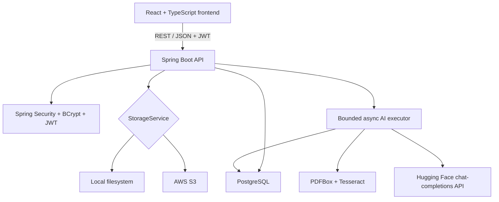

# AarogyaKul

### AI-powered family health records that turn medical PDFs into structured, comparable health timelines


AarogyaKul is a full-stack healthcare platform for organizing a family's medical history. Its flagship **AI Report Reader** accepts laboratory-report PDFs, extracts clinical parameters, normalizes parameter names, compares results with the member's previous reports, produces a plain-English summary, and adds the result to a longitudinal health timeline.

The project is designed around a practical reality: medical records are often scattered across PDFs, providers, devices, and family members. AarogyaKul converts those disconnected documents into structured, searchable context without pretending to replace a clinician.

> **Clinical disclaimer:** AarogyaKul summarizes uploaded records for informational use. It does not diagnose conditions, prescribe treatment, or replace professional medical advice.

## Why It Matters

- **One family workspace:** Keep profiles, allergies, chronic conditions, reports, and timelines together.
- **Structured health data:** Convert unstructured laboratory PDFs into typed parameters with values, units, and reference ranges.
- **Longitudinal context:** Compare each parameter with the most recent prior result for the same family member.
- **Readable AI output:** Translate comparison data into a concise summary instead of exposing raw model output.
- **Resilient document intake:** Use PDFBox first and automatically fall back to Tesseract OCR for scanned PDFs.
- **Asynchronous UX:** Return `202 Accepted` after upload while processing continues in a bounded background executor.
- **Deployable storage:** Run locally without cloud credentials, then switch to AWS S3 through configuration.

## Flagship AI Pipeline

```mermaid
flowchart LR
    A["PDF upload"] --> B["Validate PDF and 15 MB limit"]
    B --> C["Store locally or in AWS S3"]
    C --> D["Return 202 Accepted"]
    D --> E["PDFBox text extraction"]
    E -->|"Insufficient text"| F["Tesseract OCR fallback"]
    E --> G["Llama strict JSON extraction"]
    F --> G
    G --> H["Canonicalize parameter names"]
    H --> I["Persist MedicalParameter rows"]
    I --> J["Compare with latest prior result"]
    J --> K["Llama plain-English summary"]
    K --> L["Mark COMPLETED and create timeline event"]
```



Every stage has an explicit responsibility and failure boundary:

1. **Validate:** Reject empty, non-PDF, or oversized uploads before storage.
2. **Extract:** Read embedded text with Apache PDFBox; render and OCR pages at 250 DPI when required.
3. **Parse:** Prompt Llama for JSON containing report date, parameter, value, unit, and reference range.
4. **Normalize:** Map common synonyms to stable parameter names before persistence and comparison.
5. **Compare:** Query the latest earlier value for the same member and parameter, then calculate absolute and percentage change.
6. **Summarize:** Generate a human-readable explanation from comparison JSON.
7. **Finalize:** Persist the insight, transition status to `COMPLETED`, and create a linked timeline event.

Failed jobs transition to `FAILED` with a user-visible processing error; temporary upload files are deleted in all outcomes.

## System Architecture



### Technology Stack

| Layer | Technology | Responsibility |
|---|---|---|
| Frontend | React 19, TypeScript, Vite, Tailwind CSS, Axios, React Router | Responsive application shell, auth, uploads, polling, timelines, report insights |
| Backend | Java 21, Spring Boot 3.5, Spring Web, Validation | REST API, DTO contracts, orchestration, error handling |
| Security | Spring Security, JWT, BCrypt strength 12 | Stateless authentication and owner-scoped authorization |
| Persistence | PostgreSQL 17, Spring Data JPA | Family graph, documents, parameters, comparisons, insights, events |
| Document AI | Apache PDFBox, tess4j/Tesseract, Hugging Face Llama | Text extraction, OCR fallback, structured parsing, summarization |
| Storage | Local filesystem or AWS S3 SDK v2 | Pluggable document persistence and S3 pre-signed access support |
| Infrastructure | Docker Compose, Maven, pnpm | Reproducible local development and builds |

## Product Capabilities

### Family Workspace

- Register and authenticate with JWT-backed sessions.
- Create one family workspace per user for the MVP.
- Add, update, and remove family members.
- Record blood group, relationship, allergies, and chronic conditions.

### Medical Documents

- Upload blood reports, prescriptions, discharge summaries, and other PDFs.
- Enforce PDF-only uploads with a 15 MB maximum on both frontend and backend.
- Track `PENDING`, `PROCESSING`, `COMPLETED`, and `FAILED` states.
- Poll processing status and display extracted parameters and AI summaries.

### Health Timeline

- Create timeline events after successful report processing.
- Show events in reverse chronological order.
- Link timeline events back to their source documents.

### User Experience

- Public product landing page and protected clinical dashboard.
- Responsive monochromatic slate interface designed for clinical clarity.
- Semantic green, amber, and red reserved for medical states and trends.
- Empty, loading, failure, and processing states across core workflows.

## Repository Layout

```text
AarogyaKul/
|-- aarogyakul-backend/
|   |-- src/main/java/com/aarogyakul/
|   |   |-- config/          # Security, async executor, S3 configuration
|   |   |-- controller/      # DTO-only REST endpoints
|   |   |-- service/ai/      # OCR, Llama parsing, comparison, insights
|   |   |-- entity/          # JPA persistence model
|   |   |-- repository/      # Owner-scoped and timeline queries
|   |   `-- exception/       # Consistent API error envelope
|   `-- src/test/            # Unit, context, live service, and pipeline tests
|-- aarogyakul-frontend/
|   |-- src/api/             # Typed Axios resource clients
|   |-- src/components/      # Shared layout, form, document, and UI components
|   |-- src/context/         # AuthContext and session persistence
|   |-- src/pages/           # Landing, auth, dashboard, member, upload, timeline
|   `-- scripts/             # Dependency-free frontend SSR smoke tests
|-- docker-compose.yml       # PostgreSQL 17 development service
|-- init-db.sql              # Explicit schema and performance indexes
`-- design.md                # Clinical design tokens and UI rules
```

## Quick Start

### Prerequisites

- Java 21 and Maven 3.9+
- Node.js 20.19+ and pnpm 10+
- Docker Desktop or a PostgreSQL 17 instance
- Hugging Face API token for AI extraction and summarization
- Tesseract installation only when scanned-PDF OCR is required

### 1. Start PostgreSQL

```bash
docker compose up -d postgres
docker compose ps
```

Spring Data JPA manages the development schema with `ddl-auto=update`. For explicit provisioning or schema review, use `init-db.sql` against an empty database.

### 2. Configure and run the backend

```bash
cd aarogyakul-backend
cp .env.example .env
```

At minimum, set `HUGGINGFACE_API_KEY` and replace the development `JWT_SECRET`. Load `.env` into the shell before starting Spring Boot:

```bash
# Linux/macOS
set -a && source .env && set +a
mvn spring-boot:run
```

```powershell
# Windows PowerShell
Get-Content .env | Where-Object { $_ -match '^\s*[^#][^=]+=.*' } | ForEach-Object {
  $pair = $_ -split '=', 2
  [Environment]::SetEnvironmentVariable($pair[0], $pair[1], 'Process')
}
mvn spring-boot:run
```

The API starts at `http://localhost:8080`.

### 3. Run the frontend

```bash
cd aarogyakul-frontend
pnpm install
pnpm dev
```

Open `http://localhost:5173`. Vite proxies `/api` to the backend during development. For a separately hosted API, set `VITE_API_BASE_URL` before building the frontend.

## Configuration Reference

| Variable | Required | Default | Purpose |
|---|---:|---|---|
| `DATABASE_URL` | No | `jdbc:postgresql://localhost:5432/aarogyakul` | JDBC connection URL |
| `DATABASE_USERNAME` | No | `aarogyakul` | Database user |
| `DATABASE_PASSWORD` | No | `aarogyakul` | Database password |
| `JWT_SECRET` | Production | Development fallback | JWT signing secret; use at least 32 random characters |
| `JWT_EXPIRY_HOURS` | No | `24` | Access-token lifetime |
| `HUGGINGFACE_API_URL` | No | Hugging Face router chat-completions URL | Llama-compatible endpoint |
| `HUGGINGFACE_API_KEY` | AI pipeline | Empty | Hugging Face bearer token |
| `LLAMA_MODEL_NAME` | No | `meta-llama/Llama-3.1-8B-Instruct` | Extraction and summary model |
| `STORAGE_MODE` | No | `local` | Select `local` or `s3` storage |
| `LOCAL_STORAGE_DIR` | No | OS temp directory | Local document directory |
| `AWS_ACCESS_KEY_ID` | S3 only | Empty | AWS credential |
| `AWS_SECRET_ACCESS_KEY` | S3 only | Empty | AWS credential |
| `AWS_S3_BUCKET_NAME` | S3 only | Empty | Document bucket |
| `AWS_REGION` | S3 only | `ap-south-1` | Bucket region |
| `TESSDATA_PREFIX` | OCR only | Empty | Tesseract language-data path |
| `SERVER_CORS_ORIGIN` | No | `http://localhost:5173` | Allowed frontend origin |
| `VITE_API_BASE_URL` | Hosted frontend | Same origin | Frontend API base URL |

### Enable AWS S3

```bash
export STORAGE_MODE=s3
export AWS_ACCESS_KEY_ID=...
export AWS_SECRET_ACCESS_KEY=...
export AWS_S3_BUCKET_NAME=aarogyakul-documents
export AWS_REGION=ap-south-1
```

Uploaded objects use the deterministic key `documents/{memberId}/{documentId}.pdf`.

## REST API

All protected endpoints require `Authorization: Bearer <token>`. API responses use DTOs; persistence entities are never exposed directly.

| Method | Endpoint | Description |
|---|---|---|
| `POST` | `/api/auth/register` | Register and issue JWT |
| `POST` | `/api/auth/login` | Authenticate and issue JWT |
| `POST` | `/api/families` | Create the user's family workspace |
| `GET` | `/api/families/me` | Get the authenticated user's family |
| `POST` | `/api/families/{familyId}/members` | Add a family member |
| `GET` | `/api/families/{familyId}/members` | List family members |
| `GET` | `/api/members/{memberId}` | Get a member profile |
| `PUT` | `/api/members/{memberId}` | Update a member profile |
| `DELETE` | `/api/members/{memberId}` | Delete a member |
| `POST` | `/api/members/{memberId}/allergies` | Add an allergy |
| `DELETE` | `/api/members/{memberId}/allergies/{allergyId}` | Remove an allergy |
| `POST` | `/api/members/{memberId}/conditions` | Add a chronic condition |
| `DELETE` | `/api/members/{memberId}/conditions/{conditionId}` | Remove a condition |
| `POST` | `/api/members/{memberId}/documents` | Upload PDF and return `202 Accepted` |
| `GET` | `/api/members/{memberId}/documents` | List a member's documents |
| `GET` | `/api/documents/{documentId}` | Poll status and retrieve insight |
| `DELETE` | `/api/documents/{documentId}` | Delete document and derived records |
| `GET` | `/api/members/{memberId}/timeline` | Get reverse-chronological timeline |

Errors follow a stable envelope:

```json
{
  "error": {
    "code": "VALIDATION_ERROR",
    "message": "Only PDF uploads are supported"
  }
}
```

## Security and Reliability

- Stateless Spring Security filter chain with HS256 JWT authentication.
- BCrypt password hashing with strength 12.
- Ownership checks on families, members, documents, allergies, conditions, and timelines.
- Strict DTO boundary between HTTP responses and JPA entities.
- PDF type and size validation on both client and server.
- Pluggable storage abstraction; S3 implementation supports short-lived pre-signed URLs.
- Bounded AI executor: 2 core threads, 4 maximum threads, queue capacity 20.
- Database indexes for member documents, parameter history, and timeline ordering.
- Transactional persistence and explicit cleanup of derived records during deletion.
- Consistent global exception envelope for client-safe failures.

## Testing

### Backend unit and integration tests

```bash
cd aarogyakul-backend
mvn test
```

The standard suite uses H2 and covers application startup, parameter canonicalization, Llama JSON recovery/parsing, and historical comparison behavior.

### Frontend smoke and production checks

```bash
cd aarogyakul-frontend
pnpm run test:smoke
pnpm run build
```

The SSR smoke suite verifies landing, login, and registration rendering plus shared medical-document formatting behavior. The production build runs strict TypeScript project checks before Vite bundling.

### Opt-in live service tests

Live tests are disabled unless `RUN_LIVE_TESTS=true`. With Hugging Face and AWS credentials loaded:

```bash
cd aarogyakul-backend
RUN_LIVE_TESTS=true mvn -Dgroups=live test
```

The live test tier validates:

- Hugging Face chat-completions connectivity.
- AWS S3 write, read, and delete permissions.
- End-to-end registration, family/member creation, generated PDF upload, asynchronous AI processing, extracted parameters, insight generation, and deletion.

## Judge Demo Flow

1. Open the landing page and introduce the unstructured-family-record problem.
2. Register, create a family, and add a member.
3. Upload a sample blood-report PDF and point out the immediate `202` workflow.
4. Watch the processing state transition from `PENDING` to `PROCESSING` to `COMPLETED`.
5. Review extracted parameters, units, ranges, and the generated summary.
6. Upload a second report to demonstrate prior-result comparison and trend context.
7. Open the member timeline and follow the event back to its source document.
8. Close on the architecture: OCR resilience, strict JSON extraction, owner-scoped security, async processing, and deployable S3 storage.

## MVP Scope and Roadmap

The current MVP deliberately supports one family per user and focuses on report intelligence. Medication tracking, insurance storage, and multi-family support are outside the hackathon boundary.

High-value next steps include clinician-reviewed alert policies, encrypted-at-rest document metadata, consent-based family sharing, FHIR-compatible export, multilingual summaries, audit trails, and production observability for AI latency and extraction quality.

---

**AarogyaKul** combines resilient document processing, structured medical history, and explainable trend summaries into a focused family-health workflow built for a credible hackathon demonstration and a clear path toward production hardening.
