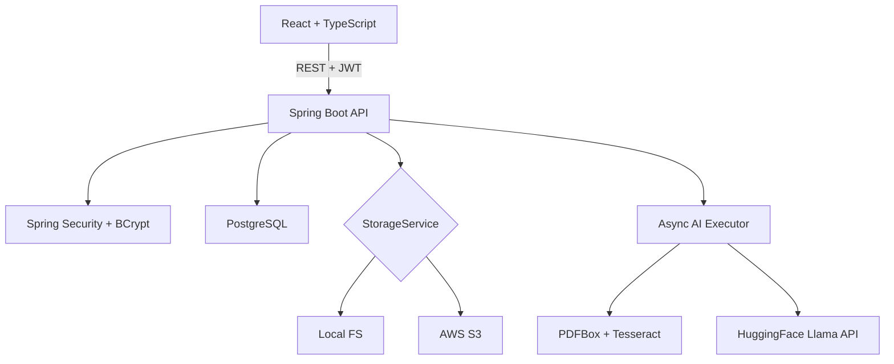

<p align="center">
  
</p>

<h1 align="center">AarogyaKul</h1>
<p align="center"><strong>AI-powered family health management — organized by intelligence, not effort.</strong></p>

<p align="center">
  
  
  
  
  
  
</p>

---

## The Problem

Indian families manage medical records across WhatsApp threads, paper folders, and phone galleries. Lab reports are unstructured PDFs. No one remembers if their cholesterol improved since the last test. Finding an old prescription means scrolling through months of chat history.

## Our Solution

**AarogyaKul** gives every family a shared, AI-powered health workspace. Upload a blood report PDF — our AI extracts every parameter, compares it to your history, and tells you in plain English what improved, what worsened, and when to see your doctor. All in under 3 seconds.

---

## Core Features

### 🧠 AI Report Reader — *The Flagship*
Upload a blood/lab report PDF → AI extracts structured parameters → compares with prior results → generates a plain-English summary with anomaly detection.

```
PDF Upload → PDFBox/OCR → Llama JSON Extraction → Canonicalization → Comparison → Summary → Timeline
```

### 👨‍👩‍👧‍👦 Netflix-Style Multi-Profile
OTT-inspired profile picker. Each family member has their own dashboard, documents, and timeline — all linked to one secure account. Only the account owner can create/edit profiles.

### 📁 Document Vault
Store blood reports, prescriptions, bills, insurance documents, medical IDs, and more. Filter by category. No more digging through chat history.

### 📊 Smart AI Insights
No more wall-of-text summaries. The AI Insights page shows:
- **Status banner** — ✅ All OK / ⚠️ Needs Attention / 🔴 Concerning
- **Flagged values** — only the out-of-range parameters, highlighted with ↑ High / ↓ Low
- **Parameters table** — every extracted value with color-coded status pills
- **Collapsible detailed analysis** — full AI narrative, hidden by default

### 📅 Health Timeline
Chronological view of all medical events — doctor visits, vaccinations, surgeries, lab tests, medication changes, and notes. Auto-generated from uploads + manually added entries.

### 🏥 Clinical Notes
Allergies with severity levels. Chronic conditions with diagnosis dates. Everything a doctor needs in one glance.

---

## Tech Stack

| Layer | Technology |
|-------|-----------|
| **Frontend** | React 19, TypeScript, Vite, Tailwind CSS, Recharts, Axios, React Router |
| **Backend** | Java 21, Spring Boot 3.5, Spring Security, Spring Data JPA, Maven |
| **Database** | PostgreSQL 17 |
| **AI / ML** | Llama 3.1 (via HuggingFace Inference API), Apache PDFBox, Tesseract OCR |
| **Cloud** | AWS S3 (pre-signed URLs), BCrypt auth, JWT security |

---

## Architecture



### AI Pipeline Flow

```mermaid
flowchart LR
    A["PDF Upload"] --> B["Validate (PDF, ≤15MB)"]
    B --> C["Store in S3/Local"]
    C --> D["Return 202 Accepted"]
    D --> E["PDFBox Extract"]
    E -->|"Low text"| F["Tesseract OCR"]
    E --> G["Llama JSON Parse"]
    F --> G
    G --> H["Canonicalize Names"]
    H --> I["Save Parameters"]
    I --> J["Compare with History"]
    J --> K["Llama Summary"]
    K --> L["COMPLETED + Timeline Event"]
```



---

## Quick Start

### Prerequisites
- Java 21 + Maven 3.9+
- Node.js 20+ and pnpm 10+
- Docker (for PostgreSQL) or a PostgreSQL 17 instance
- HuggingFace API key

### 1. Database
```bash
docker compose up -d postgres
```

### 2. Backend
```bash
cd aarogyakul-backend
cp .env.example .env    # Set HUGGINGFACE_API_KEY and JWT_SECRET
```

```bash
# Linux/macOS
set -a && source .env && set +a
mvn spring-boot:run
```

```powershell
# Windows PowerShell
Get-Content .env | Where-Object { $_ -match '^\s*[^#][^=]+=.*' } | ForEach-Object {
  $pair = $_ -split '=', 2
  [Environment]::SetEnvironmentVariable($pair[0], $pair[1], 'Process')
}
mvn spring-boot:run
```

API runs at `http://localhost:8080`

### 3. Frontend
```bash
cd aarogyakul-frontend
pnpm install
pnpm dev
```

App runs at `http://localhost:5173`

---

## Environment Variables

| Variable | Required | Purpose |
|----------|:--------:|---------|
| `DATABASE_URL` | — | JDBC URL (default: `localhost:5432/aarogyakul`) |
| `DATABASE_USERNAME` | — | DB user (default: `aarogyakul`) |
| `DATABASE_PASSWORD` | — | DB password (default: `aarogyakul`) |
| `JWT_SECRET` | Production | ≥32 char signing secret |
| `HUGGINGFACE_API_KEY` | ✅ | HuggingFace bearer token |
| `LLAMA_MODEL_NAME` | — | Default: `meta-llama/Llama-3.1-8B-Instruct` |
| `STORAGE_MODE` | — | `local` (default) or `s3` |
| `AWS_ACCESS_KEY_ID` | S3 only | AWS credential |
| `AWS_SECRET_ACCESS_KEY` | S3 only | AWS credential |
| `AWS_S3_BUCKET_NAME` | S3 only | Document bucket |
| `AWS_REGION` | S3 only | Default: `ap-south-1` |

---

## Project Structure

```
AarogyaKul/
├── aarogyakul-backend/
│   └── src/main/java/com/aarogyakul/
│       ├── config/        # Security, S3, async executor
│       ├── controller/    # REST endpoints (DTO-only responses)
│       ├── service/ai/    # OCR, Llama client, extraction, insights
│       ├── entity/        # JPA models (UUID primary keys)
│       ├── repository/    # Owner-scoped queries
│       └── exception/     # Global error handler
├── aarogyakul-frontend/
│   └── src/
│       ├── api/           # Typed Axios clients
│       ├── context/       # AuthContext, ProfileContext
│       ├── components/    # AppLayout, UI kit, MemberForm
│       └── pages/         # All feature pages
├── docker-compose.yml
└── init-db.sql
```

---

## API Endpoints

All protected routes require `Authorization: Bearer <token>`.

| Method | Endpoint | Description |
|--------|----------|-------------|
| POST | `/api/auth/register` | Register + get JWT |
| POST | `/api/auth/login` | Login + get JWT |
| POST | `/api/families` | Create family workspace |
| GET | `/api/families/me` | Get user's family |
| POST | `/api/families/{id}/members` | Add member |
| GET / PUT / DELETE | `/api/members/{id}` | Member CRUD |
| POST | `/api/members/{id}/documents` | Upload PDF → `202 Accepted` |
| GET | `/api/members/{id}/documents` | List documents |
| GET / DELETE | `/api/documents/{id}` | Get/delete document + insights |
| GET / POST / DELETE | `/api/members/{id}/timeline` | Timeline CRUD |
| POST / DELETE | `/api/members/{id}/allergies/{id}` | Allergy management |
| POST / DELETE | `/api/members/{id}/conditions/{id}` | Condition management |

---

## Security

- JWT (HS256) stateless authentication
- BCrypt password hashing (strength 12)
- Owner-scoped authorization on all resources
- PDF-only uploads, 15 MB limit (client + server)
- S3 files via short-lived pre-signed URLs
- DTO boundary — JPA entities never exposed to clients
- Bounded async executor (2–4 threads, queue 20)

---

## Demo Flow

1. **Land** → Show the product landing page with the AI demo panel
2. **Register** → Create account and family workspace
3. **Add profiles** → Netflix-style profile picker, add family members
4. **Upload** → Click `+ Upload`, select a blood report PDF
5. **Watch AI** → Status transitions: Pending → Processing → Completed
6. **Review** → Status banner, flagged anomalies, parameters table
7. **Second report** → Upload again to see trend comparisons
8. **Timeline** → View auto-generated + manual events chronologically
9. **Vault** → Browse all documents filtered by category
10. **Architecture** → OCR resilience, async processing, owner-scoped security

---

## Scope

This is a hackathon MVP. Deliberately out of scope:
- Medication tracking
- Multi-family support
- Insurance claim processing

---

<p align="center">
  Built with ❤️ for <strong>BharatAcademix CodeQuest Hackathon</strong>
</p>
